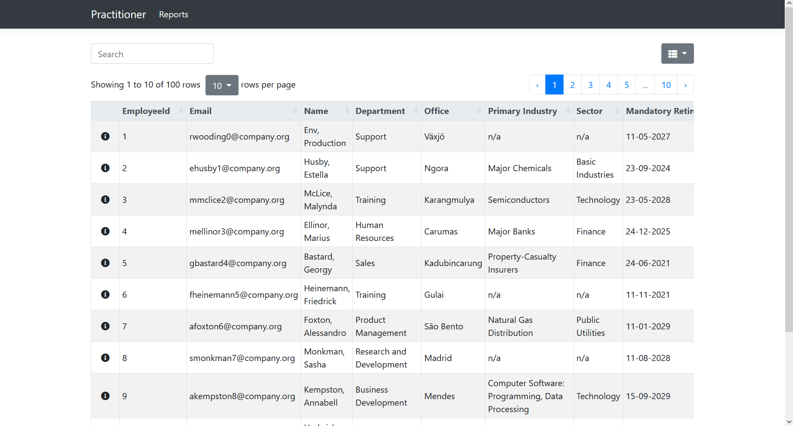
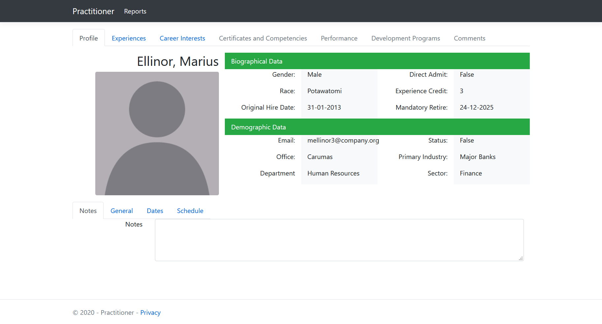
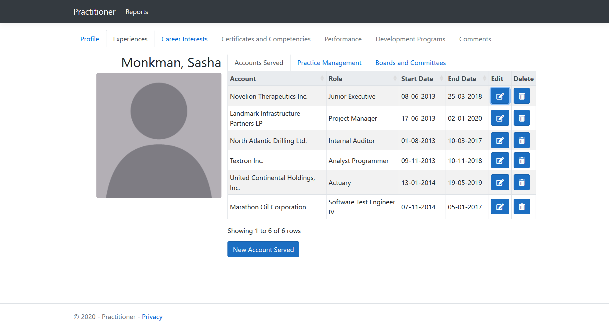
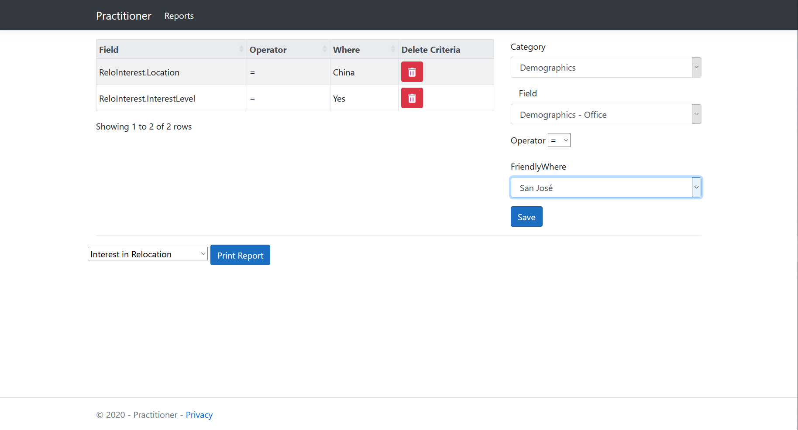

# Practitioner
> A human resources application that allowed users to better service a sub-set of high-level employees. Created with ASP.NET Core, Dapper and MS SQL Server

## Table of contents
* [General info](#general-info)
* [Screenshots](#screenshots)
* [Technologies](#technologies)
* [Setup](#setup)
* [Features](#features)
* [Status](#status)
* [Inspiration](#inspiration)
* [Contact](#contact)

## General info
The app tracked and allowed CRUD operations on a cadre of employee history / preference / demographic data points and contained an on-the-fly criteria builder for reporting.

## Screenshots
* Home - Employee List

* Employee Profile

* Experience Tab w/ edit, delete, creation

* Report Criteria Builder

## Technologies
* ASP.NET Core - version 3.1
* Dapper - version 2.0.35
* Bootstrap - version 4.5
* MS SQL Server - version 2019 Developer

## Setup
To run this project:
1. Clone and build locally
2. Mock data, table structures, and stored procedures can be found in /sql
3. Run all .sql files on MS SQL Server to restore DB
4. Add your MS SQL Server connection string in appsetting.json for production or appsettings.Development.json for development\
5. Set your environement variable in launchSettings.json

## Features
* Search for and filter employees
* Create, Edit, and Delete experience/interests records for employees
* Generate reports with built in report criteria builder

To-do list:
* Create Angular front-end
* Create API's for Angular functionality
* Add unit tests for manintainability
* Add Authentication and Authorization

## Status
Project is: _in progress_
Practitioner is a sandbox for me to integrate what I am learning into one consistant project so that I can learn how all the pieces work together. Practitioner will likely remain in progess indefinitely.

## Inspiration
Special thanks to my Project Manager and mentor, Karen. Her guidence inspired me to create one large project instead of many little feature projects.

## Contact
Created by [@TelefunkenU87](https://github.com/TelefunkenU87) - feel free to contact me!